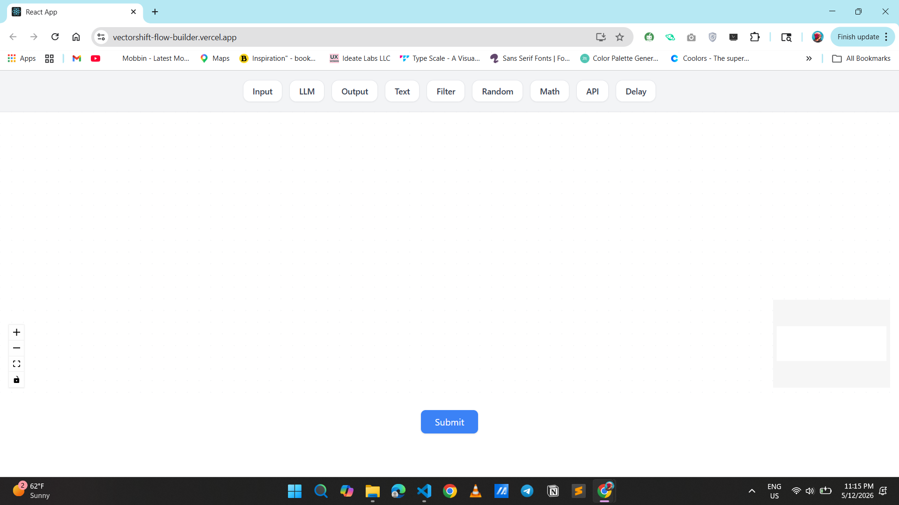
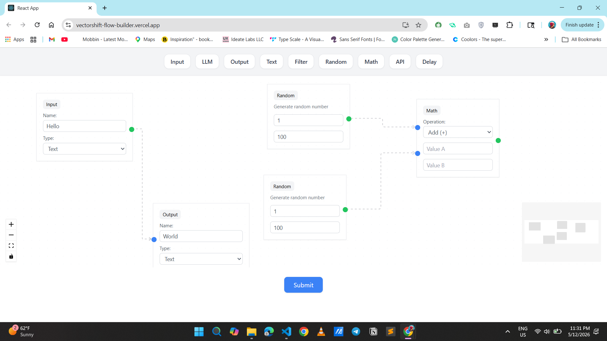
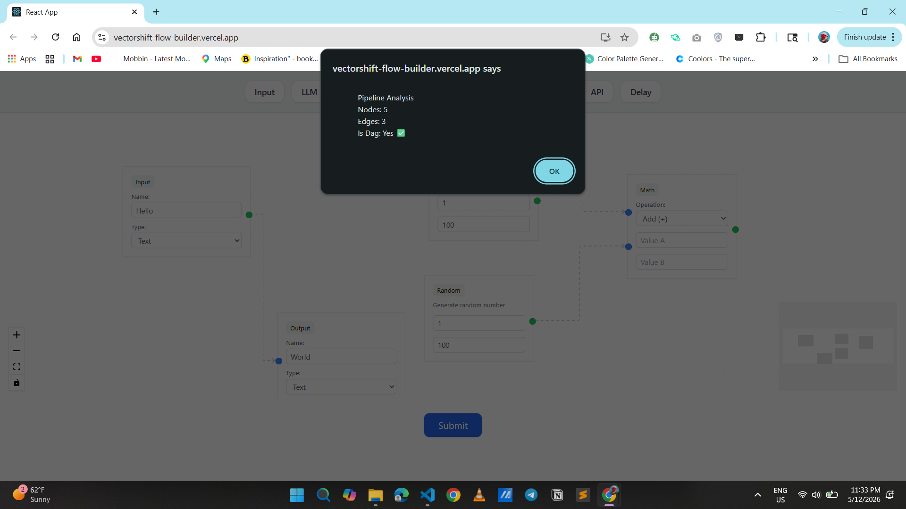

# VectorShift Flow Builder

A visual pipeline builder built with React and React Flow as part of the VectorShift Frontend Technical Assessment.

## 🚀 Live Demo

https://vectorshift-flow-builder.vercel.app/

---

## ✨ Features

### ✅ Reusable Node Abstraction
Created a reusable `BaseNode` component to reduce duplicated code and make node creation scalable and maintainable.

### ✅ Custom Nodes
Implemented multiple custom nodes including:

- Input Node
- Output Node
- Text Node
- LLM Node
- Filter Node
- Random Node
- Math Node
- API Node
- Delay Node

### ✅ Modern UI Styling
- Clean responsive layout
- Centered toolbar
- Improved spacing and node appearance
- Better visual consistency

### ✅ Dynamic Pipeline Building
Users can:
- Drag and drop nodes
- Connect nodes visually
- Create custom workflows

### ✅ Backend Integration
Integrated frontend with a FastAPI backend.

On submit:
- Nodes and edges are sent to backend
- Backend calculates:
  - Number of nodes
  - Number of edges
  - Whether the graph is a DAG (Directed Acyclic Graph)

### ✅ DAG Validation
Implemented graph cycle detection logic to determine whether the pipeline forms a valid DAG.

---

## 🛠️ Tech Stack

### Frontend
- React
- React Flow
- JavaScript
- Tailwind CSS

### Backend
- Python
- FastAPI

### Deployment
- Vercel

---

## 📦 Installation

### Frontend

cd frontend
npm install
npm start
```

### Backend

cd backend
uvicorn main:app --reload
```

---

## 📸 Screenshots

### Flow Builder UI


---

### Connected Nodes



---

### DAG Validation



---

## 🧠 What I Learned

Through this project I learned:

- React component abstraction
- Reusable architecture design
- React Flow basics
- Frontend and backend integration
- API communication using fetch
- Basic FastAPI concepts
- DAG validation logic

---

💡 Future Improvements
Save/load pipelines
Export pipeline configurations
Improved DAG visualization
Authentication and user projects

---

## 📄 License

This project was built for educational and assessment purposes.